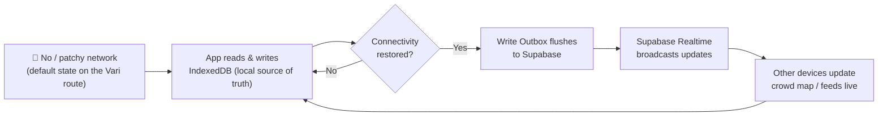
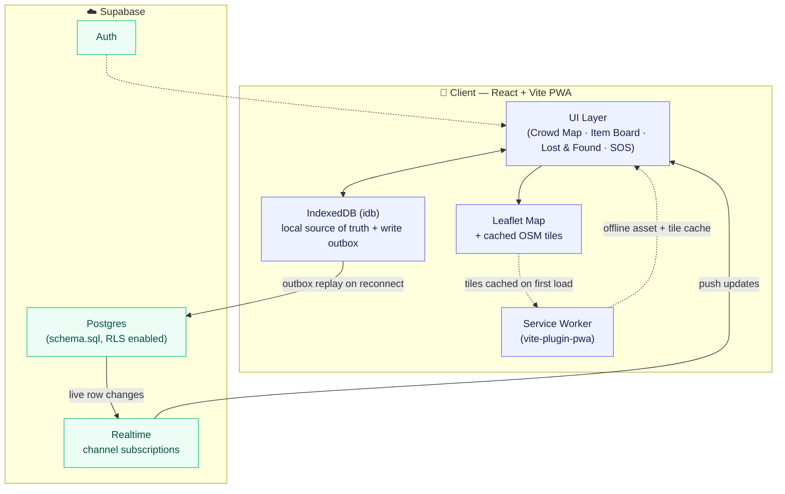
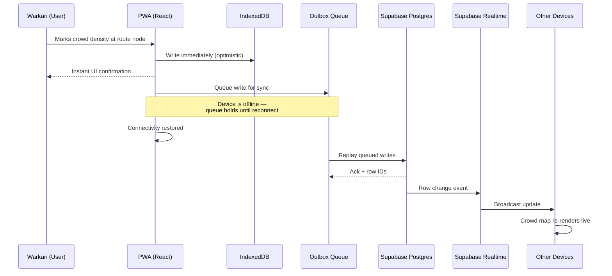
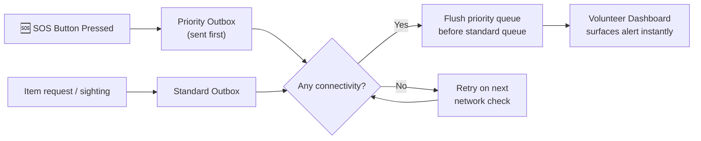

# 🚩 Pandharpur Vari Companion

**Offline-first PWA for the Pandharpur Vari pilgrimage** — live crowd-density route maps, peer item lending, lost-and-found check-ins, and priority SOS alerts, built to keep working even when mobile networks disappear into the crowd.


---

## Table of Contents

- [Why this exists](#why-this-exists)
- [Core idea](#core-idea)
- [System architecture](#system-architecture)
- [Offline-first sync flow](#offline-first-sync-flow)
- [SOS priority outbox](#sos-priority-outbox)
- [Feature set](#feature-set)
- [Tech stack](#tech-stack)
- [Getting started](#getting-started)
- [Supabase setup](#supabase-setup)
- [Project structure](#project-structure)
- [Roadmap / feature order implemented](#roadmap--feature-order-implemented)

---

## Why this exists

The Pandharpur Vari brings millions of pilgrims (*warkaris*) walking together over several weeks, often through areas with patchy or non-existent connectivity. Existing coordination tools assume "always online" — this app assumes the opposite: **the network is the exception, not the rule.**

Every core feature is designed to work first against a local IndexedDB store, then sync opportunistically to Supabase the moment connectivity returns.

## Core idea



The app never blocks a user action on network availability — every write lands locally and instantly, then propagates when it can.

## System architecture



## Offline-first sync flow

What happens when a warkari reports crowd density with no signal, then walks into range of a tower:



## SOS priority outbox

SOS alerts jump the queue ahead of ordinary writes (item requests, sightings) so emergencies sync first the instant any connectivity appears:



## Feature set

| Feature | What it does |
|---|---|
| 🗺️ **Crowd density route map** | Leaflet map with live Supabase Realtime subscription; falls back to offline queue when disconnected |
| 🤝 **Peer item lending** | Item request feed with GPS attachment so nearby pilgrims can respond |
| 🔎 **Lost & found** | Group-code check-in timeline to reunite separated groups |
| 🆘 **SOS button** | Fixed priority button with outbox replay ahead of all other traffic |
| 🧑‍💼 **Volunteer dashboard** | Panel for active alerts, sightings, and item requests |
| 📦 **Offline map tiles** | Service worker caches OSM tiles on first load for offline route rendering |

## Tech stack

- **Frontend:** React + Vite + Tailwind CSS
- **PWA:** `vite-plugin-pwa` with a custom service worker for tile caching
- **Maps:** Leaflet, offline-cached OpenStreetMap tiles
- **Local storage:** IndexedDB via `idb` — local source of truth + write outbox
- **Backend:** Supabase (Postgres, Auth, Realtime-ready schema)

## Getting started

```bash
npm install
cp .env.example .env.local
npm run dev
```

Set `VITE_SUPABASE_URL` and `VITE_SUPABASE_ANON_KEY` in `.env.local` to enable live data.
**Without them, the app still runs fully offline** using IndexedDB and seeded route nodes — useful for demos with no backend at all.

## Supabase setup

1. Open the Supabase SQL editor for your project.
2. Run [`supabase/schema.sql`](./supabase/schema.sql).
3. Note: Row Level Security is enabled on all tables with **permissive hackathon policies** (`using (true)`).
   - For production, restrict writes to authenticated group members.
   - Protect personal contact fields.
   - Crowd map and item board reads can remain public where appropriate.

## Project structure

```
for-vari/
├── src/                # App source (components, hooks, offline/sync logic)
├── supabase/
│   └── schema.sql      # Postgres schema + RLS policies
├── .env.example         # Supabase URL / anon key template
├── index.html
├── package.json
├── tsconfig.json
└── vite.config.ts
```

## Roadmap / feature order implemented

1. ✅ Crowd density route map with live Realtime subscription and offline queue
2. ✅ Peer-to-peer item request feed with GPS attachment
3. ✅ Lost-and-found group code check-in timeline
4. ✅ Fixed SOS button with priority outbox replay
5. ✅ Volunteer dashboard panel for active alerts, sightings, and requests
6. ✅ Service worker caches map tiles on first load for offline route rendering

---

<p align="center"><i>Built for the Pandharpur Vari — designed to work where the network doesn't.</i></p>
